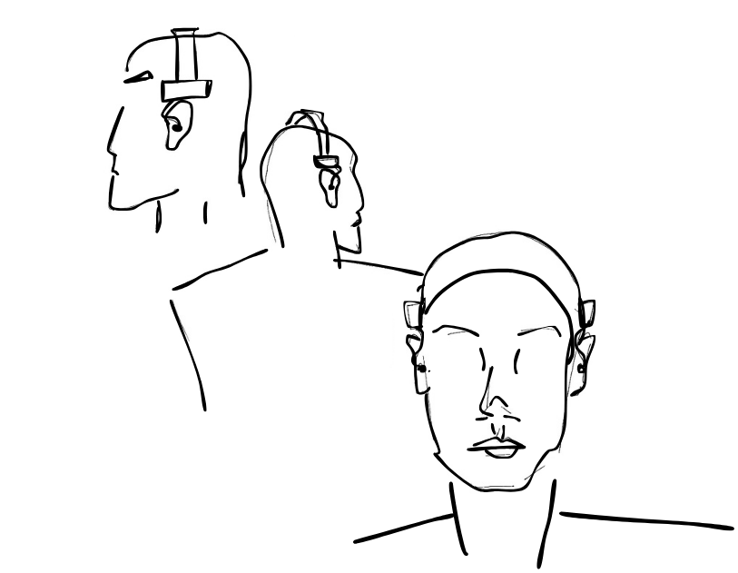

  <h1>Tiresias Hardware</h1>
   
Altium Designer Hardware files for the Tiresias Hearing Aid project 

  

  
  
  

## Introduction

This repository contains the Altium Designer Project for the Tiresias Hearing Aid Development Board. 

The Tiresias project is part a partnership between the Brazilian Schools [FOB-USP](https://www1.fob.usp.br) and [EESC-USP](https://www.eesc.usp.br/) aiming to adress some of the Brazilian healthcare system's demands. Conduced by the [GMETA](https://sel.eesc.usp.br/jcarmo/metamaterials/) R&D Group, it aims to develop an open-source national technology for hearing aid applications using off-the-shelf components.

Tiresias is a low-power, resource-constrained open-source development board for hearing aid prototyping. It integrates an easy-to-program audio codec supporting both standard hearing aid functions — such as nonlinear amplitude compression and multichannel filtering — and advanced processing techniques, including adaptive filtering and beamforming for noise reduction and speech enhancement.

## System Architecture

### Key Features

- **Advanced Signal Processing**
  - Multichannel compression for improved speech intelligibility
  - Adaptive microphone directivity (beamforming, cardioid)
  - Noise reduction using directional microphone arrays

- **Wireless Connectivity & IoT Integration**
  - Bluetooth LE Audio (BT 5.4) with LC3 codec support
  - Isochronous Channels for synchronized, low-latency audio streaming
  - Support for binaural and Auracast™ systems
  - Remote configuration and smartphone/device interaction

- **Sensor Integration**
  - Voice Pick-Up Units (VPU): Bone-conduction speech capture for noisy environments
  - MEMS Microphones: Multi-microphone, low-power setups
  - Inertial Measurement Units (IMUs): Head tracking, ExG augmentation, fall detection, and health monitoring

- **Power Management**
  - Support for rechargeable Li-Po batteries
  - Power Management ICs (PMICs) for voltage regulation and safe charging

### Hardware overview

The project uses a [nRF5340 SoC](https://www.nordicsemi.com/Products/nRF5340) from [Nordic Semiconductors](https://www.nordicsemi.com). It contains an **application proccessor** for handling the main functions and a dedicated **network processor** for handling Bluetooth Low Energy (BLE) connectivity. Moreover, the design integrates:

- **[ADAU1787 Audio Codec](https://www.analog.com/en/products/adau1787.html)**  audio codec from [Analog Devices](https://www.analog.com/en/index.html) with integrated digital signal processing (DSP) instructions for real-time signal processing;
- Onboard **Nordic [nPM1100 PMIC](https://www.nordicsemi.com/Products/nPM1100)** battery management system for portable operation;
-  **Multiple [AMM-3742-T-WP-R MEMS microphones](https://puiaudio.com/product/microphones/amm-3742-t-wp-r)** from [PUI Audio](https://puiaudio.com/) for beamforming and noise reduction applications;
-  **[V2S200D](https://www.mouser.com/datasheet/2/218/v2s200d_user_guide-3179748.pdf) Digital Voice Vibration Sensor** from [Knowless](https://www.knowles.com/) for self-speech recognition and adaptation; 
-  **[BMI270[(https://www.bosch-sensortec.com/products/motion-sensors/imus/bmi270/) Inertial Measurement Unit** from [Bosch](https://www.bosch-sensortec.com/) for motion and physiological data monitoring;
-  **[MX25R1635](https://www.mxic.com.tw/zh-tw/flash-memory-solutions/automotive/Pages/spec.aspx?p=MX25R1635F&m=Automotive&n=PM2744) 16Mb Flash Memory** from [Macronix International{(https://www.mxic.com.tw/en-us/Pages/default.aspx);
- Versatile I/O interface for seamless development;
- Compact 40x25mm six-layer PCB for streamlined deployment.

  

### Firmware overview

Firmware is available and documented in the [Tiresias Firmware Repo](https://github.com/felipepimentab/tiresias-fw).

## Usage 

  

### Target User

Tiresias can be applied in hearing aid **researchers and product developers**. It provides a flexible and accessible tool for researchers and innovators in the field of hearing solutions, as well as for consumer audio designers.

### How to use it

Tiresias is built using Nordic Semiconductor's **nRF Connect Software Development Kit (NCS)**, which integrates the **Zephyr Real-Time Operating System**. For the audio processing scheme on the DSP, Analog Devices offers the **SigmaStudio SDK** for its family of audio processors, which features a GUI that enables the user to configure fixed-function processors. In the firmware repository a Driver for the ADAU1787 has been developed so that the user can flash the application usign the nRF processor. 

Thus, **software-wize**, make shure you have:

- Nordic [nRF Connect SDK](https://www.nordicsemi.com/Products/Development-software/nRF-Connect-SDK/GetStarted#infotabs)
- Analog Devices [SigmaStudio](https://www.analog.com/en/resources/evaluation-hardware-and-software/embedded-development-software/ss_sigst_02.html)
- Firmware repository content 

Tiresias has no interfae microprocessor, so it is loaded uding its Serial Write Debug interface (10-pin, 1.27mm), which can be controlled using a Jlink programmer or another microprocessor acting as such (a nRF5340 in another DK, for instance). 

For its first version, we decided to use external speaker sets, so the user must have a balanced armature or an in-ear phone. A good setup for using it would be the one shown in the figure above, that holds a Tiresias PCB on each of the user's temples and connects them to in-ear phones. This will be soonly implemented and made publically available. 

So, **hardware-wize**:

- A Jlink debuger 
- Speakers of some kind

## Funding

To the present, this project has been completelly financed by the University of São Paulo.

## Acknowledgments

- **EESC-USP**: For providing the infrastructure and finantial support for this research.
- **Nordic Semiconductor**: For providing the nRF5340 Audio and nRF5340 Development Kits (DK) used in this project and extensive support.
- **Analog Devices**: For providing the ADAU1787 codec used in this project and extensive support.

## Contributors

<table>
  <tr>
    <td align="center">
      <a href="https://www.linkedin.com/in/joaocolombari/">
         
        
          <b>João Colombari</b>
        
      </a>
    </td>
    <td align="center">
      <a href="https://www.linkedin.com/in/felipepimentab/">
         
        
          <b>Felipe Pimenta Bernardo</b>
        
      </a>
    </td>
    <td align="center">
      <a href="https://github.com/brunochenriques">
         
        
          <b>Bruno Henriques</b>
        
      </a>
    </td>
  </tr>
</table>

## Contact

For any inquiries or further information, please contact us on LinkedIn by clicking on our profiles above.

## 📝 License

This project is licensed under the **CERN Open Hardware License - Strongly Reciprocal (CERN OHL-S)**.

You may use, modify, and distribute the hardware and software covered by this license under the terms specified in the license.

### Summary of the CERN OHL-S:

- You are free to use, modify, and distribute the hardware and/or software, provided that any derivative works are also licensed under the **CERN OHL-S**.
- If you distribute modified versions of the hardware or software, you must make the modifications available under the same license, and the modified version must include a clear notice stating that it has been modified.
- This license includes a strong reciprocity requirement, meaning that if you use the design in a commercial product, you must make the corresponding source available.

For the full text of the license, please see the [LICENSE](LICENSE) file.
