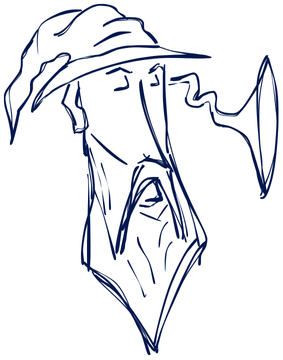
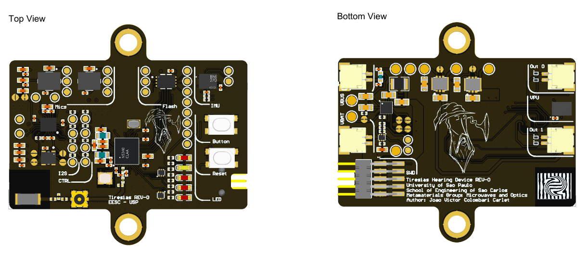

  <h1>Tiresias Hardware</h1>
   
Altium Designer Hardware files for the Tiresias Hearing Aid project 

  

  

## ☕️ Introduction

This repository contains the Altium Designer Project for the Tiresias Hearing Aid Development Board. 

The Tiresias project is a Brazilian research initiative conducted at [EESC-USP](https://www.eesc.usp.br/) by MSc students and its goal is to develop an open-source national technology for hearing aid applications using off-the-shelf components.

The hardware is based on the Nordic Semiconductor's **nRF5340 SoC** and integrates an **Analog Devices ADAU1787** audio codec, multiple microphones and sensors for assistive technologies development.

### About the Tiresias Project

The Tiresias project is an innovative effort to create an open-source and accessible hearing aid solution tailored to the needs of the Brazilian population. Our aim is to reduce dependency on expensive proprietary technologies by leveraging widely available components and state-of-the-art design practices.

### Key Features

- **Connectivity**: Utilizes the Nordic nRF5340 SoC for Bluetooth Low Energy (BLE) communication, ensuring seamless wireless connectivity.
- **Audio Processing**: Integrates the Analog Devices ADAU1787 Audio Codec for high-quality audio processing, essential for effective hearing aid functionality.
- **Open-Source**: All code and design files are open-source, allowing for community collaboration and transparency in the development process.

## 🛠️ Getting Started

### Hardware overview

The project uses a [nRF5340 SoC](https://www.nordicsemi.com/Products/nRF5340) from [Nordic Semiconductors](https://www.nordicsemi.com). It contains an **application proccessor** for handling the main functions and a dedicated **network processor** for handling Bluetooth Low Energy (BLE) connectivity. Moreover, the design integrates:

- **[ADAU1787 Audio Codec](https://www.analog.com/en/products/adau1787.html)**  audio codec from [Analog Devices](https://www.analog.com/en/index.html) with integrated digital signal processing (DSP) instructions for real-time signal processing;
- Onboard **Nordic [nPM1100 PMIC](https://www.nordicsemi.com/Products/nPM1100)** battery management system for portable operation;
-  **Multiple [AMM-3742-T-WP-R MEMS microphones](https://puiaudio.com/product/microphones/amm-3742-t-wp-r)** from [PUI Audio](https://puiaudio.com/) for beamforming and noise reduction applications;
-  **[V2S200D](https://www.mouser.com/datasheet/2/218/v2s200d_user_guide-3179748.pdf) Digital Voice Vibration Sensor** from [Knowless](https://www.knowles.com/) for self-speech recognition and adaptation; 
-  **[BMI270[(https://www.bosch-sensortec.com/products/motion-sensors/imus/bmi270/) Inertial Measurement Unit** from [Bosch](https://www.bosch-sensortec.com/) for motion and physiological data monitoring;
-  **[MX25R1635](https://www.mxic.com.tw/zh-tw/flash-memory-solutions/automotive/Pages/spec.aspx?p=MX25R1635F&m=Automotive&n=PM2744) 16Mb Flash Memory** from [Macronix International{(https://www.mxic.com.tw/en-us/Pages/default.aspx);
- Versatile I/O interface for seamless development;
- Compact 40x25mm six-layer PCB for streamlined deployment.

  

### Firmware overview

> TODO: finish the firmware overview section

Firmware is available and documented in the 

## 📝 License

> TODO: add lic file

## 📮 Acknowledgments

- **EESC-USP**: For providing the infrastructure and support for this research.
- **Nordic Semiconductor**: For providing the nRF5340 Audio and nRF5340 Development Kits (DK) used in this project and extensive support.
- **Analog Devices**: For providing the ADAU1787 codec used in this project and extensive support.

## 👥 Contributors

<table>
  <tr>
    <td align="center">
      <a href="https://www.linkedin.com/in/joaocolombari/">
         
        
          <b>João Colombari</b>
        
      </a>
    </td>
    <td align="center">
      <a href="https://www.linkedin.com/in/felipepimentab/">
         
        
          <b>Felipe Pimenta Bernardo</b>
        
      </a>
    </td>
    <td align="center">
      <a href="https://github.com/brunochenriques">
         
        
          <b>Bruno Henriques</b>
        
      </a>
    </td>
  </tr>
</table>

## 🤝 Contributing

Contributions are welcome! Fork the repository, create a feature branch, make your changes, and open a pull request.

## 📩 Contact

For any inquiries or further information, please contact us on LinkedIn by clicking on our profiles above.

Thank you for your interest in the Tiresias project!

